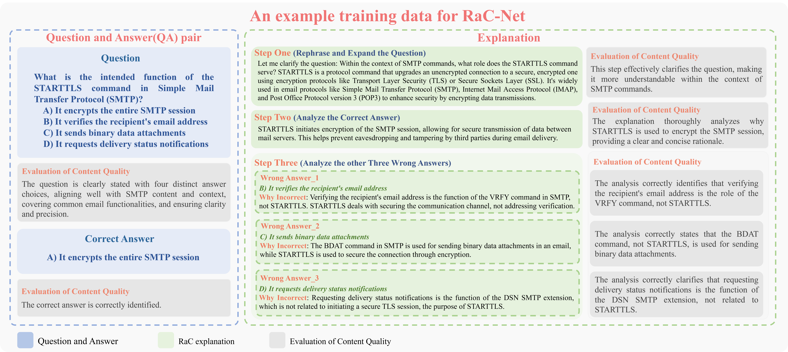
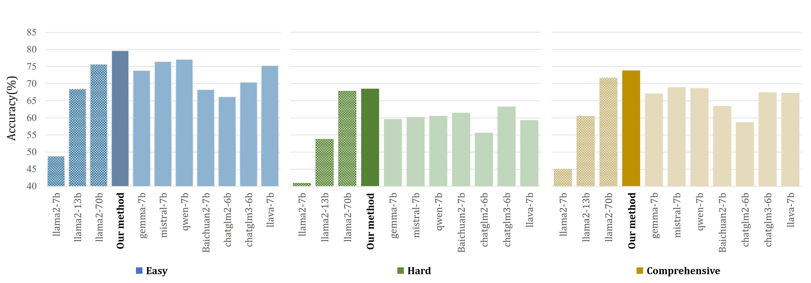

# Rephrase and Contrast: Fine-Tuning Language Models for Enhanced Understanding of Communication and Computer Networks

## Note

- This paper has been accepted by IEEE International Conference on Computing, Networking and Communications (ICNC'25).
- We want to bring readers' attention on the revision of a typo we made in the ICNC proceeding: In the abstract and the conclusion, the **accuracy improvement** of our experimental results is **28.75%**, not 63.73%. We mistook the absolute value of accuracy as the relative performance improvement. We have reached out the chair for revision, but we are told that the proceeding has been finalized and cannot be revised. Hereby we made the clarification to readers. We apologize for the confusion.


## Introduction

- This is the repository for paper [Rephrase and Contrast: Fine-Tuning Language Models for Enhanced Understanding of Communication and Computer Networks](https://arxiv.org/abs/2409.19007). 

- Main methodology of Rephrase and Contrast


- Experiment results over other baseline models


This repository includes the Llama-2-7B finetuning related files, including
- [lora weights of RaC](llama-2-7b/RaC_lora)
- [training data and released testing benchmark](#dataset)
- [training and evaluation scripts](#training-scripts)

For finetuning, please refer to the [llama-recipes README](llama-recipes/README.md) for more details.

## Environment Setup
```
git clone https://github.com/1155157110/RaC.git
cd RaC
pip install llama-recipes transformers peft openpyxl
```

Llama-2-7b model weights and converted hugging face format weights needs to be put to the [7B](llama-2-7b/7B) folder before loading models.

## Dataset
- Overview of the datasets:

- Datasets are stored in [chatbot_datasets folder](llama-2-7b/chatbot_datasets)
- How we construct the dataset:

The datasets are built upon 10 textbooks on computer networking, including both foundational theories and the latest technical advancements in the networking field. We first employed optical character recognition (OCR) software to convert the selected textbooks into textual material. Then We leveraged the GPT-4 API for
the implementation of RaC QA pair generation. Finally, QA pairs are reviewed manually. For data augmentation, we designed ChoiceBoost to augment the dataset. Please refer to our paper for more details on the implementation.
- The released test benchmarks (easy dataset, hard dataset, comprehensive dataset) are in the respective sheets of [Data_OpenSource.xlsx](llama-2-7b/chatbot_datasets/Data_OpenSource.xlsx)

## Training Scripts
The used training scripts are [training script](llama-recipes/train_eval_chatbot.sh), [k-fold training script](llama-recipes/train_eval_chatbot_kfold.sh) and [ablation training script](llama-recipes/train_eval_chatbot_ablation.sh).

Example usage:
```
cd llama-recipes
sh train_eval_chatbot.sh
```
For ablation training, an argument specifying the ablation contents is required, for example:
```
cd llama-recipes
sh train_eval_chatbot_ablation.sh qa
```

## Evaluating Scripts
Evaluating scripts load the finetuned model and executes model inference to generate outputs.

The evaluating script for k-fold is [get_prompts.py](llama-2-7b/get_prompts.py). Usage:
```
python get_prompts.py --lora_path [lora_path] --dataset [dataset]
```
For example, ``python get_prompts.py --lora_path RaC_lora --dataset EasyDataset``

After answer prompts are generated, evaluate the accuracy with [get_accuracy.py](llama-2-7b/get_accuracy.py)
```
python get_accuracy.py --dataset [dataset]
```

## Experimental Results
xxx
xxx
xxx
xxx

## Reference
To cite this paper, please add the following citation to your paper:
```
@inproceedings{wang2025rephrase,
  title={Rephrase and Contrast: Fine-Tuning Language Models for Enhanced Understanding of Communication and Computer Networks},
  author={Wang, Du, Lin, Chen, and Liew},
  booktitle={2025 International Conference on Computing, Networking and Communications (ICNC)},
  pages={1--7},
  year={2025},
  organization={IEEE}
}
```

## Questions
For enquiries about the paper or the code, please feel free to open an issue.
